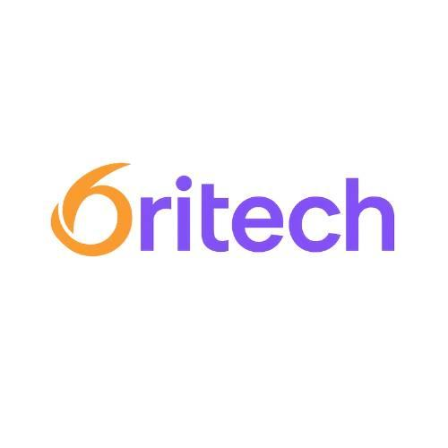
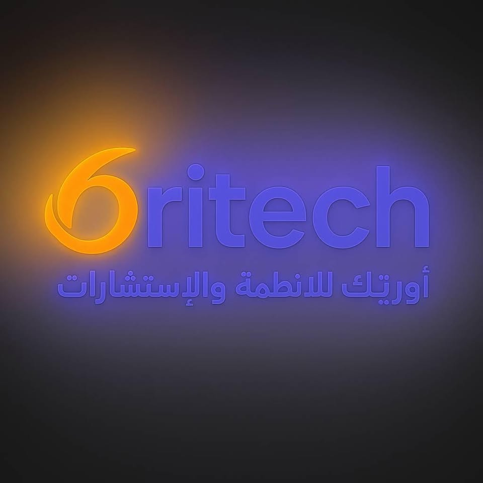

<!--
  Oritech — Organization Profile README
  Place your real logo/banner images in ./assets and update paths if needed.
-->

  

<picture>
  <source media="(prefers-color-scheme: dark)" srcset="./assets/brand.jpg">
  <source media="(prefers-color-scheme: light)" srcset="./assets/brand.jpg">
  <!-- Explicit width for brand/banner; height auto-keeps aspect ratio -->
  
</picture>

<h1 align="center">🌟 Oritech — Smart Systems & Digital Transformation 🚀</h1>

  
  
  
  

We build and integrate intelligent, secure, and user‑centric software — from ready‑made systems to tailor‑made web & mobile apps — helping organizations modernize, grow, and operate efficiently.

---

## 🧭 Table of Contents
- [✨ Vision & Mission](#-vision--mission)
- [💼 What We Do](#-what-we-do)
- [🧩 Solutions & Offerings](#-solutions--offerings)
- [🛠️ Tech Stack](#%EF%B8%8F-tech-stack)
- [⚙️ How We Work](#%EF%B8%8F-how-we-work)
- [🏆 Selected Work](#-selected-work)
- [📚 Open Source](#-open-source)
- [🤝 Contributing](#-contributing)
- [🗺️ Roadmap](#-roadmap)
- [🔒 Security](#-security)
- [🎨 Brand Kit](#-brand-kit)
- [📧 Get in Touch](#-get-in-touch)
- [📜 License](#-license)

---

## ✨ Vision & Mission

**Vision:** Enable organizations to thrive with smart, scalable, and secure technology.  
**Mission:** Deliver end‑to‑end solutions — from strategy and UX to engineering and DevOps — with measurable impact on speed, quality, and cost.

---

## 💼 What We Do

- **🧠 Systems & Consulting:** Discovery, solution architecture, and technical advisory for digital transformation.  
- **🧰 Ready‑Made & Custom Systems:** Off‑the‑shelf platforms and bespoke apps tailored to your workflows.  
- **🌐 Web & 📱 Mobile Development:** Modern, responsive, high‑performance apps with great UX.  
- **🎨 UI/UX Design:** Research‑driven design, wireframes, prototypes, and design systems.  
- **🚀 Branding & Advertising:** Cohesive brand identities and digital campaigns that convert.

> For service details, see our website.

---

## 🧩 Solutions & Offerings

- **Business Process Automation:** Workflow digitization, RBAC, audit logs, approvals.  
- **Dashboards & Analytics:** KPIs, reporting, decision support (ETL pipelines where needed).  
- **E‑Commerce & Portals:** Catalogs, payments, orders, CRM integrations.  
- **Integrations:** REST/GraphQL APIs, webhooks, SSO, ERP/CRM/Payment gateways.  
- **Ops & Reliability:** CI/CD, containerization, monitoring, incident runbooks.

---

## 🛠️ Tech Stack

**Backend:** Node.js (Express/Nest), Python (FastAPI/Django), PHP (Laravel), .NET  
**Frontend:** React / Next.js, Vue, Tailwind CSS  
**Data:** PostgreSQL, MySQL, MongoDB, Redis  
**Cloud & DevOps:** Docker, Kubernetes, Terraform, GitHub Actions  
**Quality:** Automated tests, code review, lint/format, SAST/DAST

> We choose technologies pragmatically based on goals, constraints, and team skills.

---

## ⚙️ How We Work

1. **Discover** → Goals, constraints, and success metrics  
2. **Design** → Architecture, UX flows, clickable prototypes  
3. **Build** → Agile sprints, frequent demos, automated testing  
4. **Launch** → Hardening, observability, go‑live playbooks  
5. **Grow** → Iteration, A/B testing, performance tuning

---

## 🏆 Selected Work

Replace with real projects/case studies:

- **SmartERP Suite** — Modular ERP with finance, inventory, procurement.  
- **CityPortal** — Citizen services portal with payments, tickets, dashboards.  
- **EduTrack** — E‑learning + assessment platform with analytics and content tools.

> Add repository and demo links when available.

---

## 📚 Open Source

We ❤️ community collaboration. Explore our public repos, star the projects you like, and open issues or PRs to help us improve.

- Starters (Next.js SaaS, FastAPI + Postgres)  
- CI/CD templates (GitHub Actions, Docker)  
- UI component library (WIP)

---

## 🤝 Contributing

- Read **[Contributing Guidelines](../CONTRIBUTING.md)** for setup, branching, and PR flow.  
- Use **Conventional Commits** (`feat:`, `fix:`, `docs:` …).  
- Follow **[Code of Conduct](../CODE_OF_CONDUCT.md)**.  
- For larger proposals, open a Discussion first.

**Good First Issues:** Look for `good first issue` and `help wanted` labels.

---

## 🗺️ Roadmap

- [ ] Starter templates for common business apps  
- [ ] Internal UI component library  
- [ ] Reference integrations (Payments, SMS, Email, Maps)  
- [ ] Observability templates (logs, metrics, traces)

---

## 🔒 Security

- Report vulnerabilities to **security@oriteche.com**.  
- See **[Security Policy](../SECURITY.md)** for disclosure and SLAs.  
- Never share sensitive details in public issues.

---

## 🎨 Brand Kit

Click to view colors, typography, and assets

**Colors**  
- Primary: `#0B3D91`  
- Accent: `#34D399`  
- Dark: `#0F172A`  
- Light: `#F8FAFC`

**Typography**  
- Headings: Inter / Poppins  
- Body: Inter / System UI

**Assets**  
- Logos (SVG/PNG), icons, social banners → `/brand` (or `./assets` here)

---

## 📧 Get in Touch

- 🌐 **Website:** https://oriteche.com/  
- ✉️ **Email:** info@oriteche.com  
- 💼 **LinkedIn / X:** Add official profiles  
- 💬 **Contact Form:** Link to your site’s contact page

> Prefer a structured brief? Add a **Project Intake Form** link here.

---

## 📜 License

Unless otherwise noted, content in this org is released under the **MIT License**.  
See the `LICENSE` file in each repository for details.

---

Made with ❤️ by <strong>Oritech</strong> — delivering smart systems with measurable impact.

